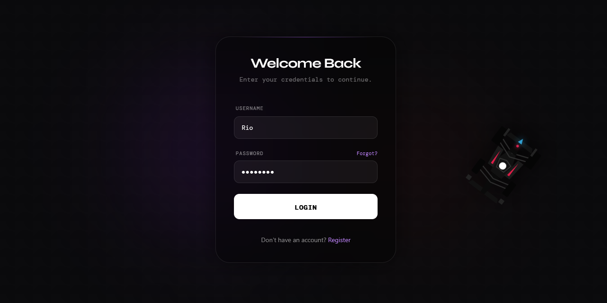
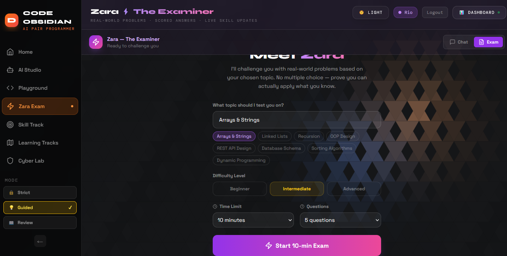
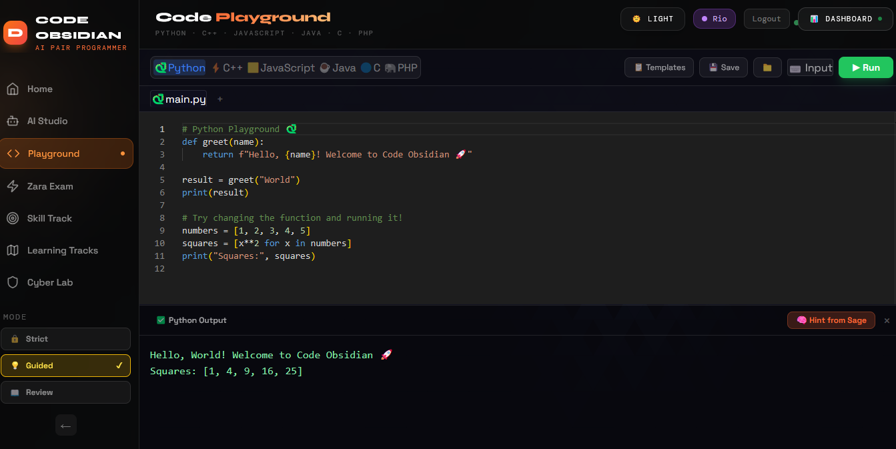
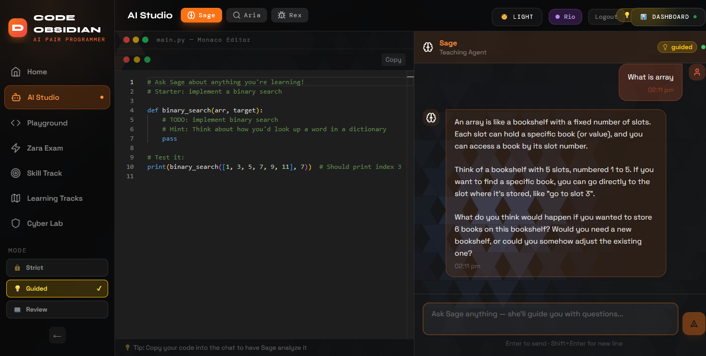
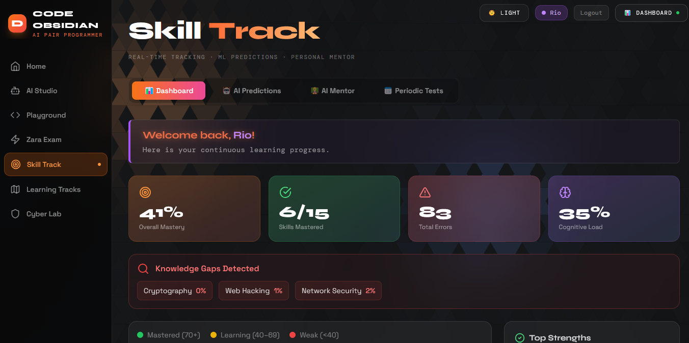
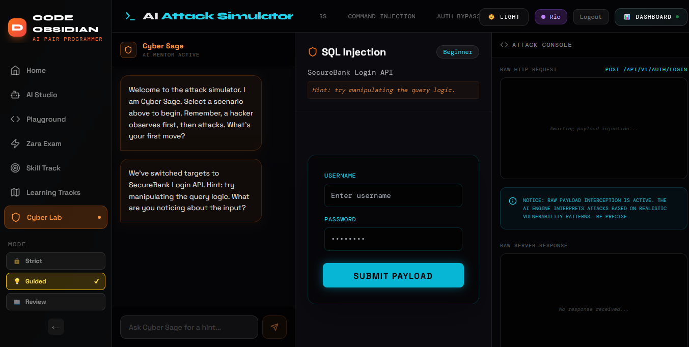
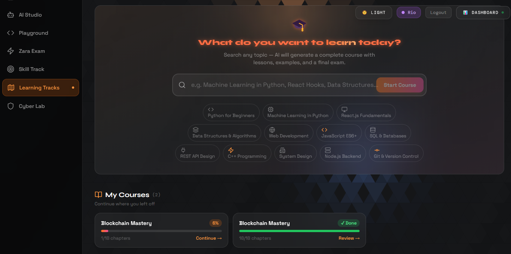
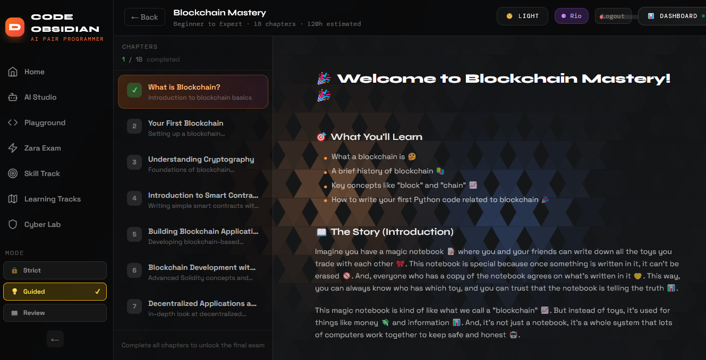

<div align="center">

# ⚔️ CODE OBSIDIAN

### *Where Cybersecurity Meets the Future of Learning*

[](http://code-obsidian-frontend.s3-website-us-east-1.amazonaws.com)
[](https://reactjs.org/)
[](https://nodejs.org/)
[](https://aws.amazon.com/)
[](https://groq.com/)

> **Code Obsidian** is a full-stack, AI-driven cybersecurity & coding education platform that feels less like a textbook and more like a high-tech command center. Learn. Hack. Evolve.


</div>

---

## 🌐 Live Demo

👉 **[http://code-obsidian-frontend.s3-website-us-east-1.amazonaws.com](http://code-obsidian-frontend.s3-website-us-east-1.amazonaws.com)**

---

## 🎯 The Problem We're Solving

Traditional cybersecurity education is **boring, static, and ineffective**. Students read theory, take quizzes, and forget everything the next week. There's no immersion, no real practice, no personalization.

**Code Obsidian flips this entirely.** We built a platform where learning cybersecurity feels like playing a high-stakes game — guided by a personal AI mentor that knows exactly where you are, what you need, and where you should go next.

---

## ✨ Key Features

### 🐉 Gamified Authentication
The moment a user lands on the app, they know this is different. A **live 3D dragon** (built with Three.js & React Three Fiber) tracks the user's cursor in real-time on the login screen — setting the tone: this is not your average learning platform.

### 🧠 AI Skill Path Prediction
Powered by the **Groq API**, the platform analyzes a user's current competencies across Python, Network Security, Web Exploitation, and more — then **predicts their optimal learning path**. Not just where you are, but where you *should* go next.

### 🔬 Cyber Lab — Learn by Doing
The heart of the platform. Four fully interactive modules:
- **AI Attack Simulator** — Input attack vectors, watch step-by-step simulations powered by AI
- **Vulnerability Visualizer** — Graphical tool showing where security weaknesses exist in real architectures
- **Payload Playground** — Safe sandbox for experimenting with SQL injection, XSS, and more with AI-assisted suggestions
- **CTF Challenges** — Capture-the-flag exercises with real success states, visual rewards, and proof of completion

### 🤖 Zara — Your AI Mentor
Not a generic chatbot. **Zara** knows what screen you're on, what skill node you're studying, and what your recent progress is. She gives contextual hints without handing you the answer — like a real mentor.

### 💻 Professional Code Editor
Powered by **Monaco Editor** (the engine behind VS Code), with syntax highlighting, embedded directly in the browser. Code runs live via the **Judge0 API** in a secure sandbox — real execution, real results.

### 🎓 Adaptive Learning Modes
- **Strict Mode** — No hand-holding, maximum challenge
- **Guided Mode** — Step-by-step hints and structured flow
- **Review Mode** — Reinforces weak areas intelligently

### 📊 Skill Graph & Progress Tracking
A living visual web showing skill competencies and connections — not a static progress bar, but a **dynamic knowledge map** that evolves with the learner.

---

## 🛠️ Tech Stack

| Layer | Technology |
|-------|-----------|
| Frontend | React 18, Vite, Tailwind CSS, Framer Motion |
| 3D & Animation | Three.js, React Three Fiber |
| Backend | Node.js, Express |
| AI / LLM | Groq API, Anthropic API |
| Code Execution | Judge0 API |
| Cloud | AWS Lambda, AWS S3, AWS CloudFormation |
| Database | SQLite (via better-sqlite3) |
| Icons & UI | Lucide React, Monaco Editor |

---

## 🚀 Try It Instantly — No Setup Required

Code Obsidian is **fully deployed on AWS** and ready to use right now.

### 👉 [Click here to launch the app](http://code-obsidian-frontend.s3-website-us-east-1.amazonaws.com)

That's it. No installation, no configuration, no local setup needed.
Just open the link and experience it. ⚡

---

## 🏗️ Architecture

```
Code Obsidian
├── Frontend (React + Vite)          → AWS S3 Static Hosting
├── Backend (Node.js + Express)      → AWS Lambda (Serverless)
├── AI Layer (Groq + Anthropic)      → Real-time AI mentoring & path prediction
├── Code Execution (Judge0)          → Secure sandboxed code runner
└── Database (SQLite)                → User progress & session data
```

---

## 📸 Screenshots

### 🐉 Login Screen — Dragon Cursor Experience


### 🤖 Zara — The AI Examiner


### 💻 Code Playground — Live Monaco Editor


### 🧠 AI Studio — Sage Teaching Agent


### 📊 Skill Track — Real-time Learning Dashboard


### ⚔️ Cyber Lab — AI Attack Simulator (SQL Injection)


### 📚 Learning Tracks — AI-Generated Courses


### 📖 Course Viewer — Structured Chapter Learning


---

## 👥 Team

| Name | Role |
|------|------|
| **Vraj Gajjar** | Full Stack & AI Integration |
| **Vedant Kapadia** | Frontend & 3D Animation |
| **Prey Patel** | Backend & AWS Cloud |
| **Het Patel** | UI/UX & Learning Design |

---

## 🔮 Future Roadmap

- [ ] Multiplayer CTF battles (team vs team)
- [ ] Real VM environments via Docker
- [ ] Certificate system for completed tracks
- [ ] Mobile app (React Native)
- [ ] Expanded AI mentor memory across sessions

---

## 📄 License

This project is licensed under the MIT License.

---

<div align="center">

**Built with ❤️ and way too much caffeine at the hackathon**

⭐ If you like what we built, give us a star!

</div>